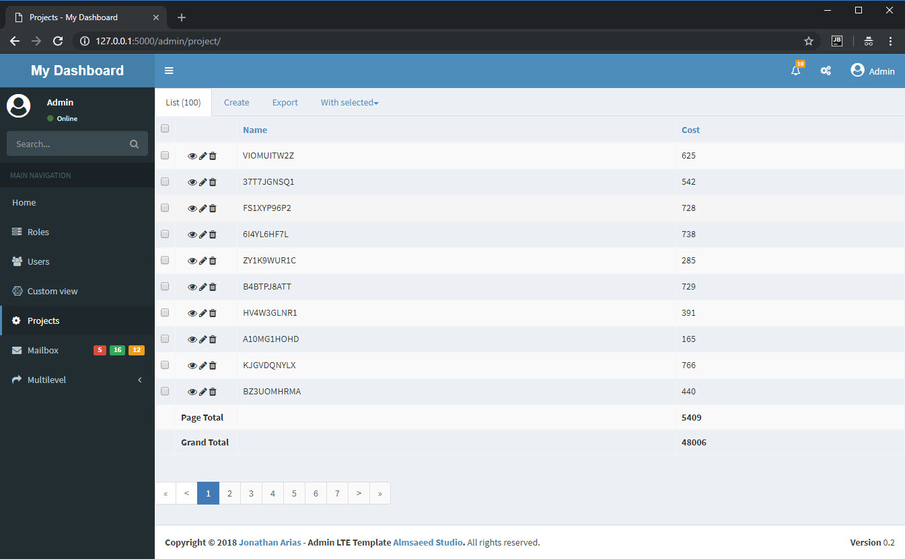

## Flask-Admin Dashboard With Summaries



This project was created in response to this SO question - [Flask Admin Models - Summary row](https://stackoverflow.com/questions/53017724/flask-admin-models-summary-row). The question references a previous SO question, [How do you add a summary row for Flask-Admin?](https://stackoverflow.com/questions/47124728/how-do-you-add-a-summary-row-for-flask-admin).

This project is a clone of [Flask-Admin-Dashboard](https://github.com/jonalxh/Flask-Admin-Dashboard) with an extra view (Projects) showing how to add summary rows to a [Flask-Admin](https://github.com/flask-admin/flask-admin) list view.

This project differentiates from the original:

- Uses the new Flask methods for running the project
- The database is initialized via a flask command ```create-database``` defined in commands.py
- Database and models have been placed in models.py
- Flask-Admin views have been placed in views.py

### Initializing the database

The project comes with a pre-initialized database (```sample_db.sqlite```). To create a new database, from a CLI, in the root of the project run:

    > flask create-database

### Running Flask

From the CLI, in the root of the project run:

    > flask run

     * Serving Flask app "app/__init__.py"
     * Environment: production
       WARNING: Do not use the development server in a production environment.
       Use a production WSGI server instead.
     * Debug mode: off
     * Running on http://127.0.0.1:5000/ (Press CTRL+C to quit)


###

To show a summary table a view needs to:

- inject summary values into the view
- define what Jinja template to use and suitably modify it to use the injected summary values

#### Setting up the Jinja template

```templates/admin/model/summary_list.html``` is a direct copy of [list.html](https://github.com/flask-admin/flask-admin/blob/master/flask_admin/templates/bootstrap3/admin/model/list.html)

Note the file name, ```summary_list.html```, as this is used in the view definition's ```render``` method.

The following block of html has been inserted at line 163:

	{# This adds the summary data #}
	
	<tr>
	    
	    <td>
	        {# leave this empty #}
	    </td>
	    
	    {# This is the summary line title and goes in the action column, note that the action may not be visible!!! #}
	    
	        <td><strong>{{ row['title'] or ''}}</strong></td>
	    
	    {# This is the summary line data and goes in the individual columns #}
	    
	        <td class="col-{{c}}">
	            <strong>{{ row[c] or ''}}</strong>
	        </td>
	    
	</tr>
	


#### Setting up the view

```views.py``` beginning at line 60.

Line 61, define the template to use:

    # don't call the custom page list.html as you'll get a recursive call
    list_template = 'admin/model/summary_list.html'

Line 75, override the view's ```render(self, template, **kwargs)``` method:

    def render(self, template, **kwargs):
        # we are only interested in the summary_list page
        if template == 'admin/model/summary_list.html':
            # append a summary_data dictionary into kwargs
            # The title attribute value appears in the actions column
            # all other attributes correspond to their respective Flask-Admin 'column_list' definition
            _current_page = kwargs['page']
            kwargs['summary_data'] = [
                {'title': 'Page Total', 'name': None, 'cost': self.page_cost(_current_page)},
                {'title': 'Grand Total', 'name': None, 'cost': self.total_cost()},
            ]
        return super(ProjectView, self).render(template, **kwargs)

Note the conditional check on the template as we're not concerned with the Edit/Create rendering and the injection of a ```summary_data``` dictionary into the method's ```**kwargs``` argument.

Note the helper methods to provide the actual summary data at lines 66 and 71, these need to be adjusted as necessary:

    def page_cost(self, current_page):
        # this should take into account any filters/search inplace
        _query = self.session.query(Project).limit(self.page_size).offset(current_page * self.page_size)
        return sum([p.cost for p in _query])
    
    def total_cost(self):
        # this should take into account any filters/search inplace
        return self.session.query(func.sum(Project.cost)).scalar()

